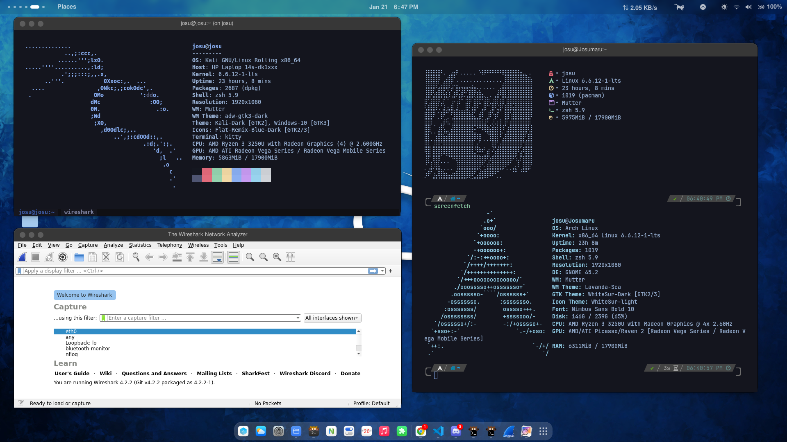
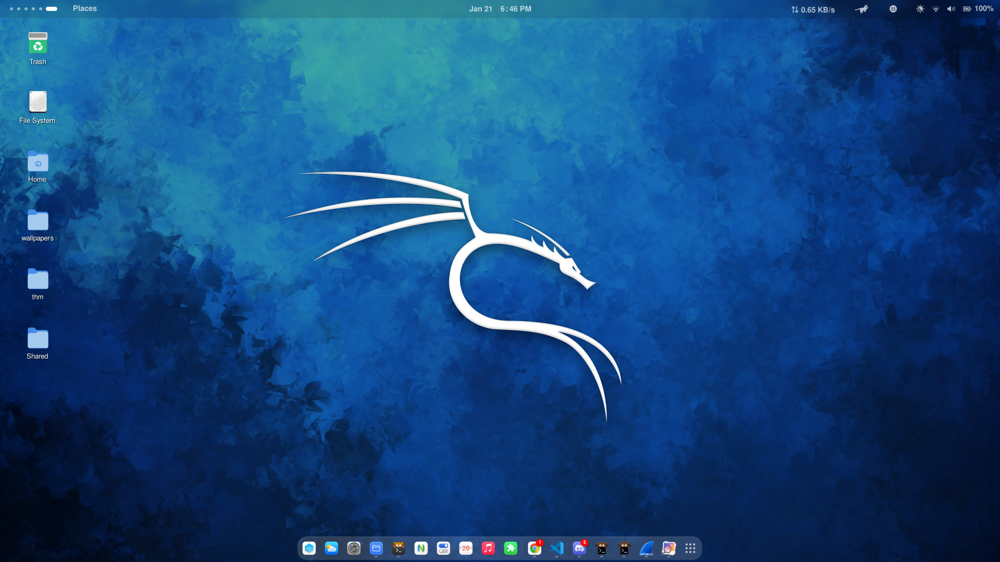
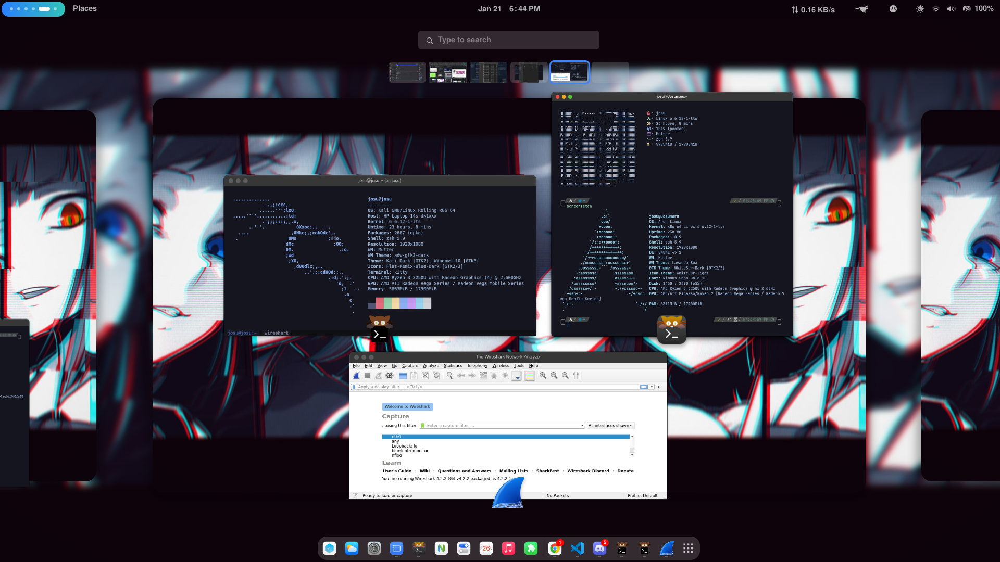

# Kali Linux Docker
This repository contains a Dockerfile to build a Kali Linux Docker image with additional features such as a custom username password, pre-installed tools for penetration testing, and an enhanced Zsh shell.





## Features
- **Custom Username and Password:** Set a custom username and password during the build process for enhanced security.

- **Pre-installed Tools:** The Docker image comes with kali-linux-default metapackage. This container contain pre-installed tools commonly used for penetration testing and security assessments.

- **Zsh Customization:** Customize the Zsh shell environment within the Docker container for an improved interactive experience, including syntax highlighting and auto-suggestion.

## Prerequisites

- Docker installed on your machine. [Docker Installation Guide](https://docs.docker.com/get-docker/)

## Building the Docker Image

1. Clone this repository to your local machine:

   ```bash
    git clone https://github.com/Josumaru/kali-linux-docker.git
   ```
2. Navigate to the kali-linux-docker directory:
   ```bash
    cd kali-linux-docker
   ```
3. Build the Docker image with make:
    ```bash
    make build
    ```
    or
    ```bash
    docker buildx build --load -f Dockerfile -t kali-linux .
    ```
    Replace "kali-linux" with on makefile with your desired image name.
4. Run the container with make:
     ```bash
    make run
    ```
    or
    ```bash
    docker run -it --name kali-linux --hostname josu -e DISPLAY=:0 -v /tmp/.X11-unix:/tmp/.X11-unix kali-linux
    ```
5. Notes


   Disclaimer: This Docker container is currently under development and may not be considered stable for production use. Use it for testing and educational purposes, and exercise caution in a production environment. Setting passwords in Dockerfiles may not be suitable for production environments. Consider more secure practices for authentication.

# Contributing

Pull requests are welcome. For major changes, please open an issue first to discuss what you would like to change.

## How to Contribute

If you would like to contribute to this project, follow these steps:

1. **Open an Issue:**
   - Before making significant changes, open an issue to discuss your proposed changes, enhancements, or new features.

2. **Fork the Repository:**
   - Fork this repository to your own GitHub account.

3. **Create a Branch:**
   - Create a new branch in your forked repository to work on the changes.
   
4. **Make Changes:**
   - Implement the changes in your branch. Ensure that your code follows the project's coding standards.

5. **Open a Pull Request:**
   - Once your changes are ready, open a pull request (PR) from your branch to the main repository.
   - Provide a clear description of your changes in the PR.

## Updating Tests

If you make changes that affect existing functionality, please update the tests to reflect these changes. New features or enhancements should ideally include corresponding tests to ensure reliability.

## Code of Conduct

By participating in this project, you agree to abide by the [Code of Conduct](CODE_OF_CONDUCT.md).

## License

This project is licensed under the [MIT License](LICENSE).

